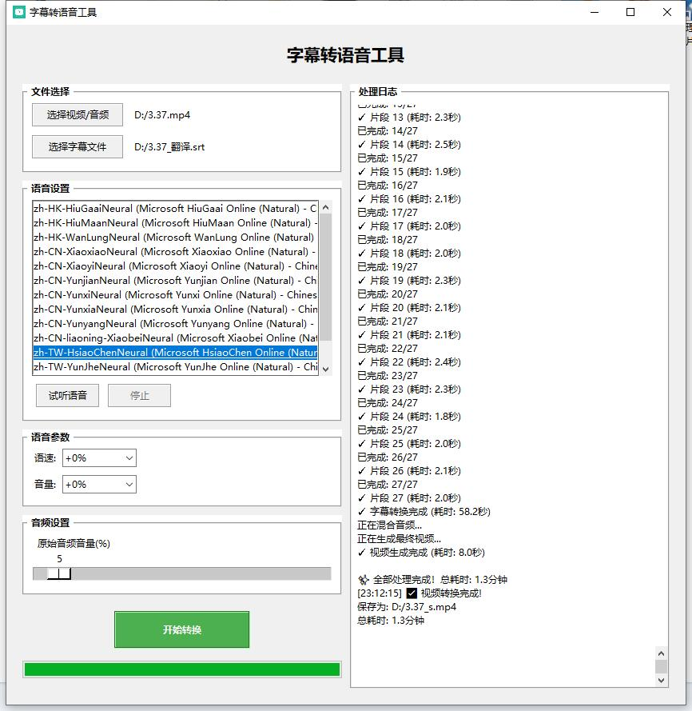

# Subtitle-to-Speech
字幕转语音工具 - 将字幕文件转换为语音并与视频混合

## 功能特点
- 支持 SRT 和 ASS 字幕文件转换
- 支持多种中文语音选择（基于 Edge TTS）
- 支持视频配音和背景音乐混合
- 实时预览语音效果
- 自动按时间轴同步音频
- 可调节语速和音量
- 支持原音频音量调节
- 实时显示转换进度

## 预览


## 系统要求
- Windows 7 及以上系统
- 网络连接（用于语音服务）
- FFmpeg（用于音视频处理）

## 快速开始
1. 从 [Releases](https://github.com/yourusername/subtitle-to-speech/releases) 下载最新版本
2. 安装 [FFmpeg](https://www.gyan.dev/ffmpeg/builds/)（如果尚未安装）
3. 运行 subtitle-to-speech.exe

## 使用说明
1. 选择视频/音频文件（可选）
2. 选择字幕文件（支持 .srt 和 .ass）
3. 选择语音并试听效果
4. 调整语音参数（语速、音量）
5. 调整原音频音量（如有）
6. 点击"开始转换"

## 开发环境
- Python 3.10+
- FFmpeg

### 从源码运行
1. 克隆仓库
```bash
git clone https://github.com/yourusername/subtitle-to-speech.git
cd subtitle-to-speech
```

2. 安装依赖
```bash
pip install -r requirements.txt
```

3. 运行程序
```bash
python subtitle_to_speech.py
```

### 手动构建
```bash
# 安装 PyInstaller
pip install pyinstaller

# 构建
pyinstaller --noconfirm pyinstaller.spec
```

## 技术栈
- Edge TTS: 微软 Edge 文字转语音服务
- PyDub: 音频处理
- pysubs2: 字幕解析
- pygame: 音频播放
- tkinter: 图形界面

## 注意事项
- 确保系统已正确安装 FFmpeg 并添加到环境变量
- 需要网络连接以使用 Edge TTS 服务
- 转换大文件可能需要较长时间
- 建议先试听语音效果再进行转换
- 如果个别片段转换失败，将自动重试并使用空白音频替代
- 如果遇到网络问题，程序会自动重试

## 更新日志
### v1.0.0 (2024-01-20)
- 初始版本发布
- 完整的字幕转语音功能
- 支持视频配音
- 支持语音预览
- 实时进度显示

## 许可证
MIT License

## 贡献
欢迎提交 Issue 和 Pull Request